# 🎬 Universal Media Downloader v3.0 (Unified)

A powerful, fast, and user-friendly media downloader supporting multiple platforms, with a unified API, quality selection, and background task processing for downloads.

This project has been refactored into a single, robust FastAPI application for easier maintenance and scalability.

## ✨ Features

### 🌐 **Multi-Platform Support**
- **YouTube** - Full quality range, progressive and adaptive formats
- **Instagram** - Reels, posts, stories, and carousels
- **Facebook** - Videos and posts
- **TikTok** - All video formats
- **Twitter/X** - Video tweets
- **Pinterest** - Video pins
- **Snapchat** - Public stories

### ⚡ **Performance Optimized**
- **Task-Based Downloads** - Downloads are processed in the background, so the API remains responsive.
- **Smart Merging** - Only merges when necessary (e.g., video-only + audio formats).
- **Redis Caching** - Optional Redis integration for caching API responses.
- **Aria2c Integration** - Optional support for the `aria2c` external downloader for multi-connection downloads.

### 🎯 **Quality Selection**
- **High Quality** - Up to 4K with automatic audio merging.
- **Audio Only** - Extract audio in various bitrates (MP3).
- **Detailed Formats** - Get information on resolution, file size, codecs, and more.

### 🔧 **Technical Excellence**
- **FastAPI** - A single, modern, fast, and auto-documenting API.
- **yt-dlp** - The latest video extraction technology.
- **Modular Platform Handlers** - Each platform's logic is cleanly separated into its own module.
- **Async Processing** - Non-blocking operations for a responsive API.

## 🚀 Getting Started

### 1. Prerequisites
- Python 3.8+
- FFmpeg (required for merging video and audio files)

### 2. Installation

```bash
# Clone the repository
git clone <repository_url>
cd downloader

# Create and activate a virtual environment
python -m venv venv
# On Windows
.\venv\Scripts\activate
# On macOS/Linux
source venv/bin/activate

# Install dependencies
pip install -r requirements.txt
```

### 3. Running the Application

The easiest way to start the development server is to use the provided PowerShell script:

```powershell
.\run_dev.ps1
```

This will:
- Start the FastAPI backend API on `http://127.0.0.1:8003`.
- Start a simple Python HTTP server for the frontend on `http://127.0.0.1:3000`.

Now, you can access the web interface at:
**http://127.0.0.1:3000/index.html**

## 📁 Project Structure

The project has been refactored to a clean, modular structure:

```
project/
├── backend/
│   ├── platforms/         # All platform-specific handlers
│   │   ├── base.py
│   │   ├── youtube.py
│   │   └── ...
│   └── utils/
│       └── sign.py        # Secure link signing utility
├── frontend/
│   ├── index.html         # Main user interface
│   └── ...
├── main_api.py            # The single, unified FastAPI application
├── run_dev.ps1            # Development startup script
└── requirements.txt       # Python dependencies
```

## 🔌 API Endpoints (v2)

### **Analyze Media**

`GET /api/v2/{platform}/info`

Returns metadata and available formats for a given URL.

- **Parameters:**
  - `platform`: `youtube`, `instagram`, `facebook`, etc.
  - `url`: The full URL of the media to analyze.

### **Start a Download Task**

`POST /api/v2/{platform}/download`

Initiates a download in the background.

- **Request Body:**
  ```json
  {
    "url": "<media_url>",
    "format_id": "<format_id>"
  }
  ```
- **Returns:**
  ```json
  {
    "task_id": "<your_task_id>"
  }
  ```

### **Check Download Status**

`GET /api/v2/task/{task_id}`

Poll this endpoint to check the status of a download task.

- **Returns:**
  - `status`: `queued`, `downloading`, `processing`, `finished`, or `error`.
  - `progress`: (if downloading) The progress percentage.
  - `filename`: (if finished) The name of the final file.
  - `download_url`: (if finished) The URL to download the file.

### **Download a Finished File**

`GET /download/{filename}`

Downloads the file produced by a completed task.

## 📊 Flow Diagram

Here’s how UI buttons map to API endpoints and results.

### Visual Diagram (SVG)


---

### Editable Mermaid Source
<details>
<summary>Click to view Mermaid code</summary>

Note: Instant-only flows use `?instant=1` on `/api/info` to get progressive direct URLs.

```mermaid
flowchart TB
  %% UI Buttons
  ui_best_mp4["⚡ Best MP4"]
  ui_best_mp3["⚡ Best MP3"]
  ui_best_merge["⚡ Best Merge (MKV/MP4)"]
  ui_instant["🎬 Smart Instant (progressive)"]
  ui_video_only["🎥 Video-only (no audio)"]
  ui_audio_only["🎵 Audio-only (rows)"]
  ui_img_single["🖼️ Smart Image"]
  ui_img_zip["🖼️ ZIP of Images"]
  ui_analyze["🔍 Analyze"]
  ui_signed["🔑 Signed Download"]
  ui_celery["📦 Universal Celery DL"]

  %% API Endpoints
  api_redirect["GET /api/redirect?url=...&format_id=best"]
  api_merge_mp3["POST /api/merge { mp3_bitrate }"]
  api_merge_best["POST /api/merge { video_format_id: 'best' }"]
  api_stream["GET /api/stream?url=...&format_id=...&filename=..."]
  api_merge_video["POST /api/merge { video_format_id }"]
  api_passthrough["GET /api/passthrough?url=...&filename=..."]
  api_zip["POST /api/{platform}/download_images_zip"]
  api_info["GET /api/v2/{platform}/info?url=..."]
  api_sign["GET /api/v2/sign?platform=...&url=...&format_id=...&filename=..."]
  api_dl["GET /dl?token=..."]
  api_v2_dl["POST /api/v2/{platform}/download { url, format_id }"]

  %% Results
  res_cdn["→ Direct CDN MP4 (progressive)"]
  res_mp3["→ Server-side MP3 transcode"]
  res_merge["→ Server merges video+audio"]
  res_stream["→ Direct MP4 stream with filename"]
  res_merge_mp4["→ Server merge + MP4"]
  res_mp3_rows["→ Server transcode → MP3"]
  res_img["→ Direct image download"]
  res_zip["→ Streamed ZIP file"]
  res_meta["→ Metadata + formats"]
  res_signed["→ One-time smart link"]
  res_task["→ Task w/ progress → /download/{file}"]

  %% Flows
  ui_best_mp4 --> api_redirect --> res_cdn
  ui_best_mp3 --> api_merge_mp3 --> res_mp3
  ui_best_merge --> api_merge_best --> res_merge
  ui_instant --> api_stream --> res_stream
  ui_video_only --> api_merge_video --> res_merge_mp4
  ui_audio_only --> api_merge_mp3 --> res_mp3_rows
  ui_img_single --> api_passthrough --> res_img
  ui_img_zip --> api_zip --> res_zip
  ui_analyze --> api_info --> res_meta
  ui_signed --> api_sign --> api_dl --> res_signed
  ui_celery --> api_v2_dl --> res_task
```


</details>

## 🌍 Public HTTPS URL and Auto-CORS (ngrok)

- **Prerequisites**: Docker Desktop installed and an ngrok auth token.
- **Start with ngrok and auto-apply CORS**:

```powershell
# Start API + worker + ngrok (compose profile), auto-apply CORS with optional extra origins
.\start_with_ngrok.ps1 -NgrokToken "<YOUR_TOKEN>" -AutoCors -Origins "http://localhost:3000"

# Alternative: generic compose helper
.\start_compose.ps1 -WithTunnel -NgrokToken "<YOUR_TOKEN>"
```

- **What it does**:
  - **Prints and copies** the public HTTPS URL to your clipboard.
  - If `-AutoCors` is used, **sets `CORS_ALLOW_ORIGINS`** to that URL and rebuilds the `api` service so it takes effect immediately.
  - You can inspect requests at: `http://localhost:4040` (ngrok inspector).

- **Retrieve only the public URL** (without modifying services):

```powershell
.\print_ngrok_url.ps1
# Quiet mode and capture in a variable
$publicUrl = .\print_ngrok_url.ps1 -Quiet; $publicUrl
```

- **Manual CORS alternative**:
  - Set in `.env`: `CORS_ALLOW_ORIGINS=<your-ngrok-https-url>`
  - Apply changes: `docker compose up -d`

### CORS for multiple origins
- **Comma-separated list** is supported. Examples:
  - In `.env` (Docker):
    ```env
    CORS_ALLOW_ORIGINS=https://app1.ngrok.app,https://app2.ngrok.app,http://localhost:3000
    ```
  - PowerShell (bare-metal):
    ```powershell
    $env:CORS_ALLOW_ORIGINS = "https://app1.ngrok.app,https://app2.ngrok.app,http://localhost:3000"
    python main_api.py  # or: uvicorn main_api:APP --host 0.0.0.0 --port 8000
    ```
  - Linux/macOS (bare-metal):
    ```bash
    export CORS_ALLOW_ORIGINS="https://app1.ngrok.app,https://app2.ngrok.app,http://localhost:3000"
    uvicorn main_api:APP --host 0.0.0.0 --port 8000
    ```

## ⚙️ Configuration

Configuration is managed via environment variables:

- `SECRET_KEY`: A secret string used for signing URLs. Defaults to a development key.
- `REDIS_URL`: The URL for your Redis instance for caching (e.g., `redis://localhost:6379`). Defaults to in-memory cache.
- `FFMPEG_PATH`: Absolute path to your `ffmpeg.exe` binary (if not in your system's PATH).
- `COOKIES_FILE`: Path to a `cookies.txt` file for platforms that require authentication.
- `ARIA2C_PATH`: Path to the `aria2c` executable to enable multi-connection downloads.

## 🛡️ Security

The API includes a signed URL feature to secure download links.

1.  **Generate a signed link:**
    `GET /api/v2/sign?platform=...&url=...&format_id=...`

2.  **Use the signed link:**
    The response will contain a `signed_url` (e.g., `/dl?token=...`) which can be used to download the file within a specific time-to-live (TTL).

### API key usage
- Set keys in `.env`: `API_KEYS=key1,key2`
- Pass header in requests: `X-API-Key: key1`

Examples:
```bash
# Analyze (YouTube)
curl -H "X-API-Key: key1" "http://localhost:8000/api/v2/youtube/info?url=https://youtu.be/dQw4w9WgXcQ"

# Start a download task
curl -X POST -H "Content-Type: application/json" -H "X-API-Key: key1" \
  -d '{"url":"https://youtu.be/dQw4w9WgXcQ","format_id":"best"}' \
  http://localhost:8000/api/v2/youtube/download

# Check task status
curl -H "X-API-Key: key1" "http://localhost:8000/api/v2/task/<task_id>"
```
